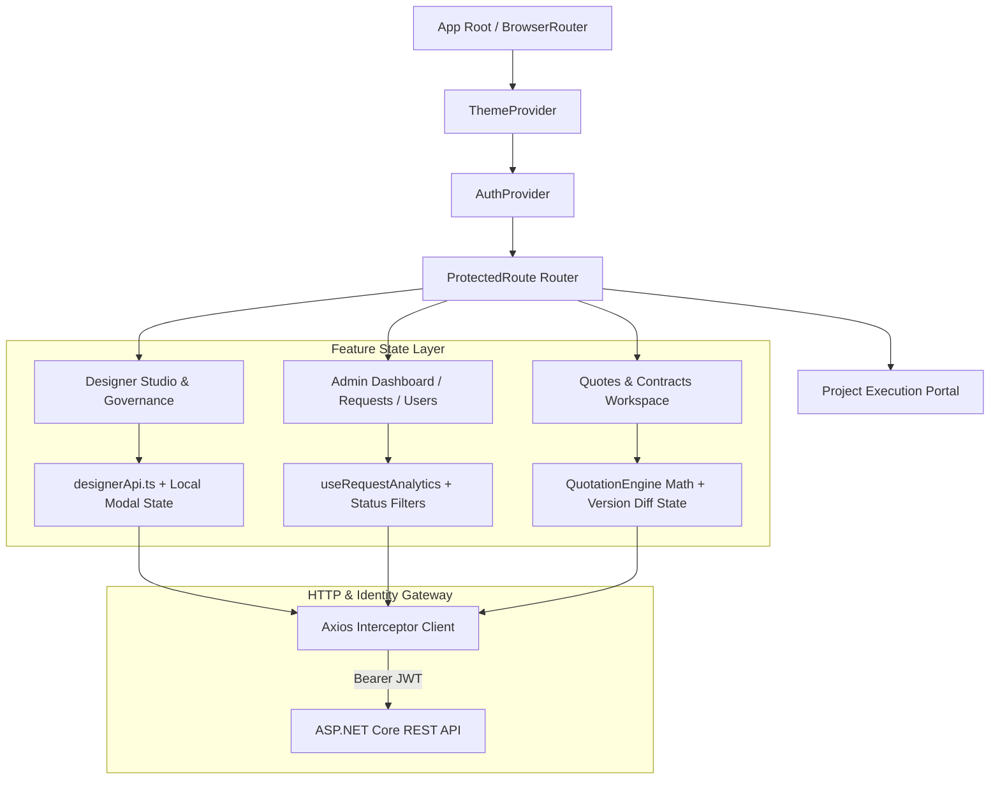

# ADR 0001: React State Management

**Status:** Accepted  
**Date:** 2026-08-25 (Updated 2026-10-05)  
**Deciders:** StyleSync Development Team (All 4 Members)  

---

## Context

The StyleSync Web Portal serves as the primary administrative and professional workspace for **Staff, Interior Designers, and Platform Administrators**. Its functional scope spans four core modules:
1. **Designer Studio & Governance (Student 1):** Designer directory filtering, portfolio management modals, listing approval governance, and capacity limits.
2. **Project Requests Oversight & Analytics (Student 2):** Request ingestion monitoring, visual timeline progression, room photo inspection, and aggregate status dashboards.
3. **Quotes & Contracts Studio (Student 3):** Live `QuotationEngine` calculations, `BudgetGuard` client budget threshold checks, 2-stage approval governance (Stage 1 Admin Release, Stage 2 Client Approval), version history comparisons, and PDF/CSV exports.
4. **Project Execution & Milestone Handoff (Student 4):** Trade coordination, physical milestone sign-offs, and contractor punch list verification.

Because four engineers collaborate simultaneously across distinct functional domains, the state management architecture needed to balance:
- **Low Overhead & Modular Independence:** Preventing monolithic reducer merge conflicts when multiple developers introduce new feature workflows.
- **Cross-Cutting Global Contexts:** Securely propagating authentication tokens (`AuthContext`), current user roles, and UI theme preferences (`ThemeContext`) across routes.
- **Server Cache & Transient UI Separation:** Distinguishing long-lived REST API data from short-lived component state (e.g., active modal views, step forms, filter bars).

---

## Decision

We adopted a **Hybrid State Management Strategy** combining React's built-in **Context API** for app-wide cross-cutting state with **Feature-Scoped Custom Hooks and Modular Service Clients** for domain state:

1. **Global App State (React Context API):**
   - `AuthContext` (`src/auth/AuthContext.tsx`): Manages authentication lifecycle, JWT decoding, active user profile (`AppUser`), and role-based route guard enforcement (`ProtectedRoute`).
   - `ThemeContext` (`src/context/ThemeContext.tsx`): Manages dark/light theme switching with persistence in local storage and synchronization across DOM attributes.

2. **Domain & Server State (Modular API Services + Custom Hooks):**
   - Each module owns encapsulated API clients and reactive hook abstractions (e.g., `src/modules/designers/services/designerApi.ts`, `src/features/requests/hooks.ts`, `src/features/requests/api.ts`).
   - Centralized Axios instance (`src/auth/authService.ts`) handles automatic JWT token injection, base URL resolution, and unified HTTP 401 error redirection.

3. **Component-Local & Form State (`useState` / `useReducer`):**
   - Interactive calculators (such as `QuotationEngine` live cost modeling), editable item tables, filter bars (`DesignerFilterBar`), and modal controls (`PortfolioProjectModal`, `CapacityStatusCard`) maintain localized reactive state without polluting global memory.

---

## Architecture & Data Flow

---

## Alternatives Considered

1. **Redux Toolkit (RTK):**
   - *Pros:* Predictable state transitions, centralized store, mature time-travel debugging.
   - *Reason for Rejection:* Introduced heavy boilerplate (slices, thunks, store wiring) that created high merge-conflict friction across 4 team members working on separate module branches. The app's asynchronous patterns are clean enough with lightweight custom hooks.
2. **Zustand:**
   - *Pros:* Minimal boilerplate, hook-based consumption, no context wrapper needed.
   - *Reason for Rejection:* While lightweight, introducing an external dependency for relatively straightforward desktop workflows was unnecessary when React Context + decoupled modular hooks already met all requirements.
3. **TanStack Query (React Query):**
   - *Pros:* Automatic cache invalidation, background refetching, query status hooks.
   - *Reason for Rejection:* Considered for server state management, but Axios + targeted `useEffect` custom hooks provided the exact control needed for our deterministic 2-stage approval flows and simplified unit testing in Vitest without mocking query client providers.

---

## Consequences

- **Positive:**
  - Zero third-party state library dependencies for core state, ensuring fast builds and bundle optimization.
  - Zero cross-module merge conflicts during feature PR merges.
  - High testability: pure utility functions and UI components can be rendered and verified independently in Vitest and React Testing Library without complex store mock setup.
- **Negative / Mitigations:**
  - High-frequency re-renders could occur if Context were abused for rapidly changing state; mitigated by restricting Context strictly to low-frequency updates (`AuthContext`, `ThemeContext`) and managing all tabular/form state locally.
