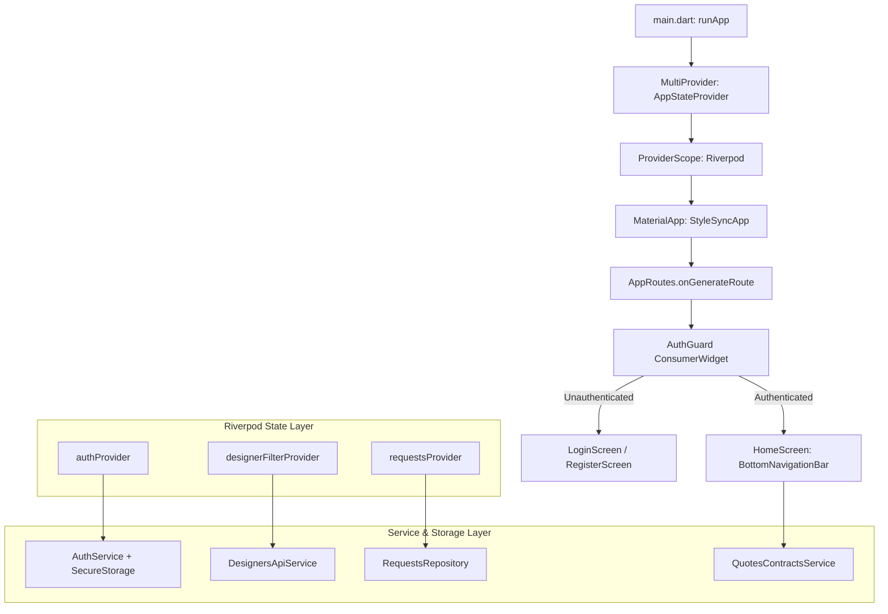

# ADR 0002: Flutter State Management

**Status:** Accepted  
**Date:** 2026-08-25 (Updated 2026-10-05)  
**Deciders:** StyleSync Development Team (All 4 Members)  

---

## Context

The StyleSync Mobile Application is designed exclusively for **Homeowners and Clients** on iOS and Android. It provides a tactile, camera-first mobile experience for:
- Capturing room dimensions, lighting conditions, and spatial constraints.
- Uploading inspiration moodboards and selecting color palettes.
- Reviewing match-score breakdowns against designer profiles.
- Inspecting quotation breakdowns, executing **Stage 2 Client Approval decisions** (Approve, Reject, or Request Changes), and signing binding project contracts.
- Tracking live milestone photo feeds and delivery timelines.

Requirements for mobile state management:
1. **Asynchronous API Lifecycle Management:** Seamless handling of loading, error, and cached states for multi-screen client journeys.
2. **Decoupled Architecture:** Freedom from `BuildContext` dependency when triggering background API updates or token validation in route guards.
3. **High Developer Velocity & Compile-Time Safety:** Protecting against runtime type errors across 4 concurrent module contributors.
4. **Coexistence with Local Preferences:** Supporting simple synchronous client settings (theme toggles, biometrics, notification flags).

---

## Decision

We chose **Flutter Riverpod (`flutter_riverpod: ^3.4.3`)** as our primary architecture for application-wide reactive state, auth sessions, and API services, paired with **Scoped Provider (`provider: ^6.1.2`)** for lightweight local UI preferences:

1. **Global Application & API State (Riverpod):**
   - Encapsulated within `ProviderScope` at the root of `lib/main.dart`.
   - `authProvider` (`lib/providers/auth/auth_provider.dart`): Employs `StateNotifier` / `Notifier` with `AuthState` to manage authentication status (`authenticated`, `unauthenticated`, `checking`), JWT tokens in `FlutterSecureStorage`, and user roles.
   - `designerFilterProvider` (`lib/providers/designers/designer_filter_provider.dart`): Reactive filters for styles, availability, and budget brackets.
   - `requestsProvider` (`lib/modules/requests/providers/requests_provider.dart`): Handles project request lists and creation lifecycles.
   - Guarded routing via `AuthGuard` (`lib/routes.dart`), directly watching `authProvider` to handle authenticated redirects.

2. **Client Preferences & Device Settings (Provider):**
   - `AppStateProvider` (`lib/main.dart`): Inherits `ChangeNotifier` to store user-specific device settings (biometric login, push notification flags, theme modes).

3. **Ephemeral Widget State (`StatefulWidget`):**
   - Used for interactive hardware pickers (`RoomPhotoPicker`, `MoodboardPicker`, `PalettePicker`), custom animation controllers, tab index tracking, and digital contract signature gestures.

---

## State Architecture Overview

---

## Alternatives Considered

1. **Provider Only:**
   - *Pros:* Simple, low learning curve.
   - *Reason for Rejection:* Relies heavily on `BuildContext` inheritance (`context.read` / `context.watch`), which leads to runtime lookup issues in nested route transitions or outside the widget tree (e.g., authentication interceptors and repository guards).
2. **BLoC (Business Logic Component):**
   - *Pros:* Extremely strict unidirectional data flow, enterprise standard for event-driven apps.
   - *Reason for Rejection:* Excessive ceremony and boilerplate (Events, States, Blocs) that slowed iteration speed during rapid sprint cycles for our 9-week deadline.
3. **GetX:**
   - *Pros:* Minimal boilerplate, integrated route management.
   - *Reason for Rejection:* Overly intrusive ecosystem that bypasses standard Flutter idioms and makes unit testing widgets less predictable.

---

## Consequences

- **Positive:**
  - Compile-time safety: Missing providers or invalid state modifications are caught before compilation.
  - Testability: Riverpod providers can be overridden cleanly in widget tests (`ProviderScope(overrides: [...])`) without mocking context hierarchies (verified across 47 passing Flutter tests).
  - Clean separation: Business logic resides entirely in repositories and notifiers, leaving widgets purely declarative.
- **Negative / Mitigations:**
  - Requires developers to understand `ConsumerWidget` and `WidgetRef`; mitigated by providing consistent sample patterns across all four feature modules.
