# ADR 0003: Agentic AI Framework and Orchestration

**Status:** Accepted  
**Date:** 2026-08-20 (Updated 2026-10-05)  
**Deciders:** StyleSync Development Team (All 4 Members)  

---

## Context

The StyleSync platform incorporates an autonomous **Agentic AI Subsystem** to automate the end-to-end interior design planning pipeline:
1. Extracting architectural styles, room geometry, lighting parameters, and palette preferences from unstructured briefs and images.
2. Formulating deterministic designer candidate matches based on verified style alignment and real-time workload capacity.
3. Generating itemized scope and cost specifications grounded in regional supplier catalogs and trade labor benchmarks.
4. Validating math integrity, budget ceilings, and regulatory compliance before staging human review.

System constraints and academic specification requirements:
- **Multi-Agent Specialization:** At least 4 distinct, single-responsibility agents executing in a coordinated sequence.
- **Deterministic Tool Gating:** Restricting tool access to each agent's strict operational domain (allow-listing).
- **Human-in-the-Loop (HITL) Gate:** The system must safely pause on high-impact financial or contractual actions, resuming only upon explicit human sign-off.
- **Backend Isolation Rule:** The AI service is strictly an internal microservice; client apps (React and Flutter) interact solely with the ASP.NET Core Web API gateway.

---

## Decision

We chose **LangGraph** (running within a Python **FastAPI** service) as our agentic orchestration framework, integrated with the ASP.NET Core backend via typed HTTP clients:

1. **Four Specialized Agents:**
   - **Agent 1: Style Analysis Agent** (`ai-service/app/agents/style_analysis_agent.py`): Parses user preferences, room dimensions, and visual moodboards into a structured `StyleProfile` (Student 2 integration).
   - **Agent 2: Designer Matching Agent** (`ai-service/app/agents/designer_matching_agent.py`): Computes match scores and filters candidates through the `CapacityGuard` (Student 1 integration).
   - **Agent 3: Budget & Scope Agent** (`ai-service/app/agents/budget_scope_agent.py`): Compiles itemized trade breakdowns (materials, labor, design fees, contingency) into a draft quote (Student 3 integration).
   - **Agent 4: Validation & Quality Agent** (`ai-service/app/agents/validation_agent.py`): Executes deterministic checks verifying budget ceilings and data completeness before approving release.

2. **Graph Topology & Delegation:**
   - Structured as a LangGraph `StateGraph` with explicit directional edges ensuring sequential execution and rollback paths.
   - Dedicated standalone endpoints (e.g., `POST /agents/style-analysis`, `POST /agents/budget-scope`) allow ASP.NET Core controllers to invoke individual sub-pipelines when needed.

3. **Human Approval Gate Governance:**
   - The graph integrates LangGraph's `interrupt()` primitive following Agent 4 validation.
   - Execution transitions into a suspended state, requiring a 2-stage approval workflow:
     - **Stage 1 (Admin Governance):** Platform admin verifies cost calculation and releases the quote to the client.
     - **Stage 2 (Client Decision):** Homeowner approves, rejects, or requests modifications on mobile. Approving automatically triggers binding contract generation.

---

## Agent Pipeline Flowchart

```mermaid
sequenceDiagram
    autonumber
    participant C as Client (Flutter / React)
    participant API as ASP.NET Core API Gateway
    participant AI as AI Service (FastAPI + LangGraph)
    participant DB as PostgreSQL Database

    C->>API: Submit Project Request Brief & Room Photos
    API->>AI: POST /workflow/run or POST /agents/style-analysis
    
    rect rgb(30, 30, 35)
        note right of AI: LangGraph StateGraph Execution
        AI->>AI: Agent 1: Style Analysis (extracts cues & geometry)
        AI->>AI: Agent 2: Designer Matching (applies capacity guards)
        AI->>AI: Agent 3: Budget & Scope (builds itemized estimates)
        AI->>AI: Agent 4: Validation (enforces math & budget caps)
        AI->>AI: interrupt() -> Pauses execution for HITL Gate
    end

    AI-->>API: Returns Enriched Workflow State
    API->>DB: Persist Workflow State, Draft Quote & Audit Logs
    API-->>C: Present Quotation for Stage 1 Admin & Stage 2 Client Approval
```

---

## Alternatives Considered

1. **Microsoft Agent Framework / Semantic Kernel:**
   - *Pros:* Native C#/.NET integration directly inside the main Web API process.
   - *Reason for Rejection:* LangGraph's Python ecosystem provided superior native integration with leading vision-language evaluation tools and simpler graph state debugging during early prototyping.
2. **LlamaIndex Workflows:**
   - *Pros:* Excellent for document-centric retrieval augmented generation (RAG).
   - *Reason for Rejection:* StyleSync requires multi-step state transformation and deterministic tool gating rather than unstructured document retrieval.
3. **Custom Python Async Scripting (No Framework):**
   - *Pros:* No external framework dependencies.
   - *Reason for Rejection:* Custom orchestration would require writing ad-hoc checkpointing, resume handlers, and state diff trackers from scratch, introducing high bug surface.

---

## Consequences

- **Positive:**
  - Clear architectural boundaries: Python service handles intelligence; ASP.NET Core handles business authorization, database persistence, and client interfaces.
  - Deterministic safety: Math and budget caps are verified deterministically by code, eliminating LLM hallucinations in financial quotes.
  - Granular testing: Each agent node is unit-tested independently in pytest, while integration is validated via end-to-end API tests.
- **Negative / Mitigations:**
  - Requires maintaining two runtimes (.NET 8 and Python 3.11); mitigated by standardizing local development with Docker Compose and centralized health check endpoints.
