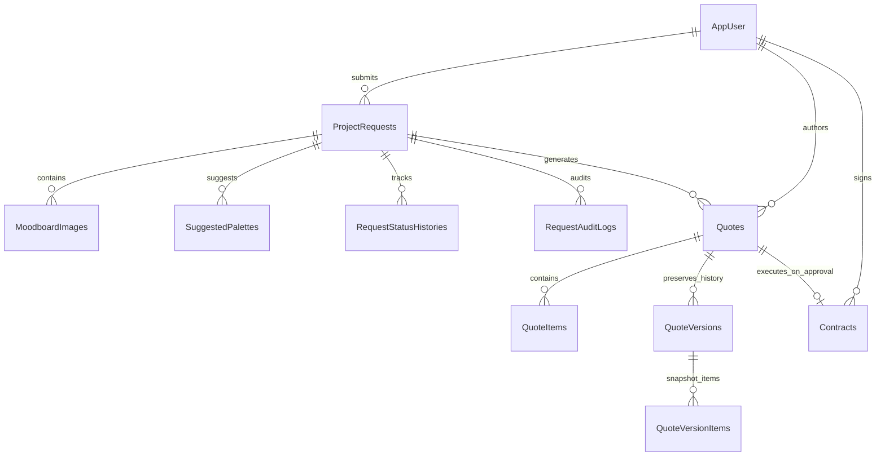

# ADR 0004: Agent Workflow State

**Status:** Accepted  
**Date:** 2026-08-20 (Updated 2026-10-05)  
**Deciders:** StyleSync Development Team (All 4 Members)  

---

## Context

The Agentic AI pipeline in StyleSync is asynchronous, multi-stage, and stateful. Workflows may span multiple minutes or hours when awaiting human approvals.
The architecture must satisfy several strict data integrity and regulatory requirements:
1. **Durable Persistence:** Workflow objectives, intermediate step outputs, tool invocation results, validation flags, and error traces must persist in durable storage across service restarts.
2. **Decoupled Operational vs. Business Storage:** High-frequency graph execution snapshots must not pollute relational business entities (users, quotes, contracts, project requests).
3. **Immutable Revision History:** Modifications requested by clients or administrators during quote negotiations must generate immutable version records rather than mutating existing rows in-place.
4. **Auditability:** Every state transition and approval event must be recorded with actor attribution and timestamps for security compliance.

---

## Decision

We adopted a **Dual-Layer Persistence Strategy** utilizing **PostgreSQL** as the unified persistence engine, partitioned between LangGraph Checkpoints and Entity Framework Core Business Tables:

```
+-----------------------------------------------------------------------------+
|                               POSTGRESQL DB                                 |
+------------------------------------+----------------------------------------+
|   1. LangGraph State Checkpoint    |   2. EF Core Relational Domain Model   |
|   (Internal Orchestrator State)    |   (Business Records & Immutable Diffs) |
+------------------------------------+----------------------------------------+
| - Raw node state snapshots         | - ProjectRequests & RequestStatusHistories
| - Thread & Run checkpoint IDs      | - RequestAuditLogs (Actor & Timestamps)
| - Pending interrupt() markers      | - Quotes, QuoteItems, QuoteVersions
| - Tool execution trace logs        | - Contracts & ContractStatus
+------------------------------------+----------------------------------------+
```

### 1. LangGraph Execution State (Checkpointer)
- Graph states are checkpointed using PostgreSQL (`langgraph-checkpoint-postgres` or serialized JSON state in workflow records).
- Preserves the full execution context (`WorkflowState`, `StyleProfile`, `DraftQuote`, `ValidationResult`), allowing seamless pause/resume execution across service restarts.

### 2. Business Entity Schema & Immutable Versioning (EF Core)
- The ASP.NET Core API persists structured domain records via Entity Framework Core (`AppDbContext`):
  - **`ProjectRequests` & `RequestStatusHistories`:** Tracks lifecycle state transitions (`Submitted`, `Matched`, `PendingReview`, `Approved`, `Cancelled`).
  - **`Quotes` & `QuoteItems`:** Stores active quote records with line-item categorization (`Materials`, `Labor`, `DesignFee`, `Contingency`, `Taxes`).
  - **`QuoteVersions` & `QuoteVersionItem`:** Maintains an append-only, immutable history of quote iterations. Each revision captures a complete snapshot with `VersionNumber`, `AuthorId`, `AuthorRole`, and timestamped differential notes.
  - **`Contracts`:** Created strictly once upon Stage 2 Client Approval, storing binding terms, locked financial totals, and transition guards (`PendingSignature` -> `Active` -> `Completed` / `Cancelled`).
  - **`RequestAuditLogs`:** Immutable security ledger logging actions, actor GUIDs, timestamps, and justification reasons.

---

## Schema Entity Relationship Diagram



---

## Alternatives Considered

1. **In-Memory Graph State:**
   - *Pros:* Zero database overhead, fast execution.
   - *Reason for Rejection:* Fails durability requirements. If the AI service restarts during human approval, the entire project brief and generated quote would be permanently lost.
2. **NoSQL / Document Database (MongoDB / CosmosDB):**
   - *Pros:* Flexible JSON document schemas matching LangGraph state dicts.
   - *Reason for Rejection:* Operating two separate database engines (Postgres for relational business data + Mongo for AI state) introduces unnecessary operational complexity, connection management overhead, and split transactions.
3. **Overwriting Quotes In-Place (No Versioning):**
   - *Pros:* Simpler single-table schema.
   - *Reason for Rejection:* Breaks the requirement for transparent cost estimation and auditability. When a client requests changes to a quote, both parties must be able to inspect previous itemized estimates side-by-side.

---

## Consequences

- **Positive:**
  - High resilience: Interrupted workflows resume reliably without duplicate LLM processing costs.
  - Full auditability: Complete visibility into every change request, quote version, and human approval decision.
  - Zero data loss: Strict foreign key constraints and transactional boundaries ensure quotes and contracts remain permanently consistent with project requests.
- **Negative / Mitigations:**
  - Database schema evolution requires coordinated EF Core migrations; mitigated by automated database migration checks on application startup (`DbSeeder.cs`).
