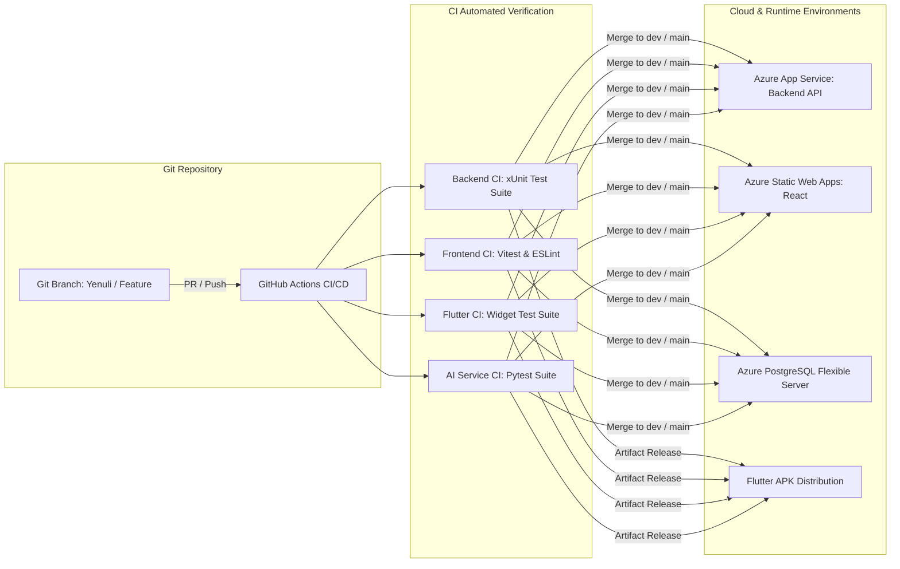

# ADR 0005: Deployment Strategy

**Status:** Accepted  
**Date:** 2026-08-20 (Updated 2026-10-05)  
**Deciders:** StyleSync Development Team (All 4 Members)  

---

## Context

The StyleSync platform comprises a distributed multi-tier architecture:
1. **ASP.NET Core 8 Web API** (Backend Gateway & Business Logic).
2. **PostgreSQL 16 Database** (Relational & Workflow Persistence).
3. **React 18 + Vite Web Application** (Staff & Designer Desktop Portal).
4. **FastAPI + LangGraph AI Microservice** (Internal Autonomous Agent Pipeline).
5. **Flutter 3.x Client Mobile Application** (Client / Homeowner Experience).

Deployment goals and constraints:
- **Cost & Accessibility:** The deployment must operate under zero-cost / student-tier cloud infrastructure (Microsoft Azure for Students, GitHub Actions) with no mandatory paid subscriptions.
- **Reliable Local Reproducibility:** Every service must run locally in a containerized environment (Docker Compose) for offline evaluations and local development.
- **Automated CI/CD Verification:** Continuous integration workflows must build and execute unit and integration test suites automatically across all stacks on every pull request and trunk merge.
- **Security & Port Isolation:** Database and service port collisions must be prevented across local host machines and cloud environments.

---

## Decision

We adopted a **Hybrid Cloud & Containerized Deployment Strategy** leveraging **Microsoft Azure** for production cloud hosting and **Docker Compose + GitHub Actions** for local and CI workflows:

| Subsystem | Cloud Target | Local / CI Target | Strategy & Configuration |
| :--- | :--- | :--- | :--- |
| **Backend Web API** | Azure App Service / Container Apps | Docker / `dotnet run` | .NET 8 Web API with automated EF Core migrations on startup, Swagger OpenAPI generation, and CORS policies. |
| **PostgreSQL Database** | Azure Database for PostgreSQL (Flexible Server) | Docker Compose (`postgres:16-alpine`) | Mapped to host port **5433** locally (`5433:5432`) to eliminate collisions with existing local Postgres instances. |
| **React Web Portal** | Azure Static Web Apps | Vite preview / Nginx | Built via `npm run build` and deployed automatically with GitHub Actions workflow; environment-driven API URLs. |
| **Agentic AI Service** | Azure Container Apps / Internal Service | Docker (`uvicorn app.main:app`) | Internal-only network visibility; invoked exclusively via backend `HttpClient` with configurable `AiService:BaseUrl`. |
| **Flutter Mobile App** | Packaged Android APK & Test Runner | Android Emulator / Physical Device | Distributed as a release APK binary with mock fallbacks and local storage persistence for reliable evaluation. |

---

## Continuous Integration & Delivery (CI/CD)

Automated GitHub Actions workflows run in parallel on all branches and pull requests to maintain high code quality:
1. **`.github/workflows/backend-ci.yml`:** Restores dependencies, builds `.NET 8` solution, and runs 98+ backend xUnit tests.
2. **`.github/workflows/frontend-ci.yml`:** Installs npm dependencies, runs ESLint, and executes 35+ Vitest component tests.
3. **`.github/workflows/flutter-ci.yml`:** Analyzes Flutter code (`flutter analyze`) and executes 47+ widget and unit tests (`flutter test`).
4. **`.github/workflows/ai-service-ci.yml`:** Validates Python linting (Ruff/Flake8) and executes pytest suites.

---

## Alternatives Considered

1. **Fully Monolithic Single-Server Deployment:**
   - *Pros:* Simpler initial deployment.
   - *Reason for Rejection:* Combining the Python runtime, .NET runtime, and Node build environment into one virtual machine creates fragile runtime dependencies and prevents independent scaling of the AI workload.
2. **AWS (ECS / RDS / S3 / Amplify):**
   - *Pros:* Industry standard cloud infrastructure.
   - *Reason for Rejection:* Higher setup complexity (IAM roles, VPC subnetting) and risk of unexpected billing past free-tier limits compared to Azure for Students credit.
3. **Platform-as-a-Service Mix (Vercel + Supabase + Render):**
   - *Pros:* Fast individual setup.
   - *Reason for Rejection:* Fragmenting deployment across 3 different vendors increases credential management overhead and creates separate failure domains during project evaluations.

---

## Consequences

- **Positive:**
  - 100% automated verification before any code lands on the main branch.
  - Port isolation: Local database on port `5433` ensures zero friction for developers running local PostgreSQL installations.
  - Zero-cost operation: Full stack runs within student-grant quotas while matching professional industry architectures.
- **Negative / Mitigations:**
  - Cold starts on free-tier app services; mitigated by lightweight health check pings and local Docker Compose fallback environments.
